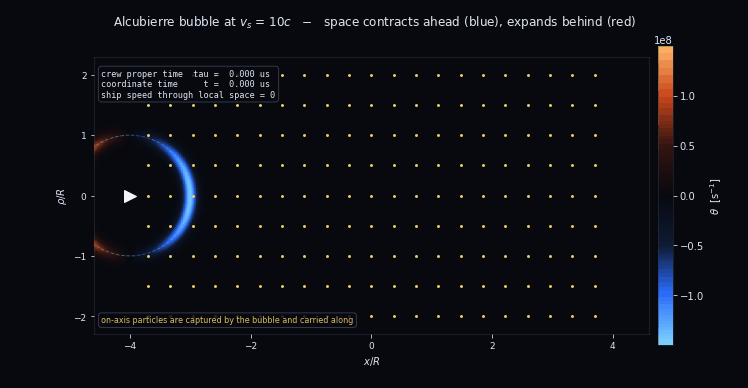
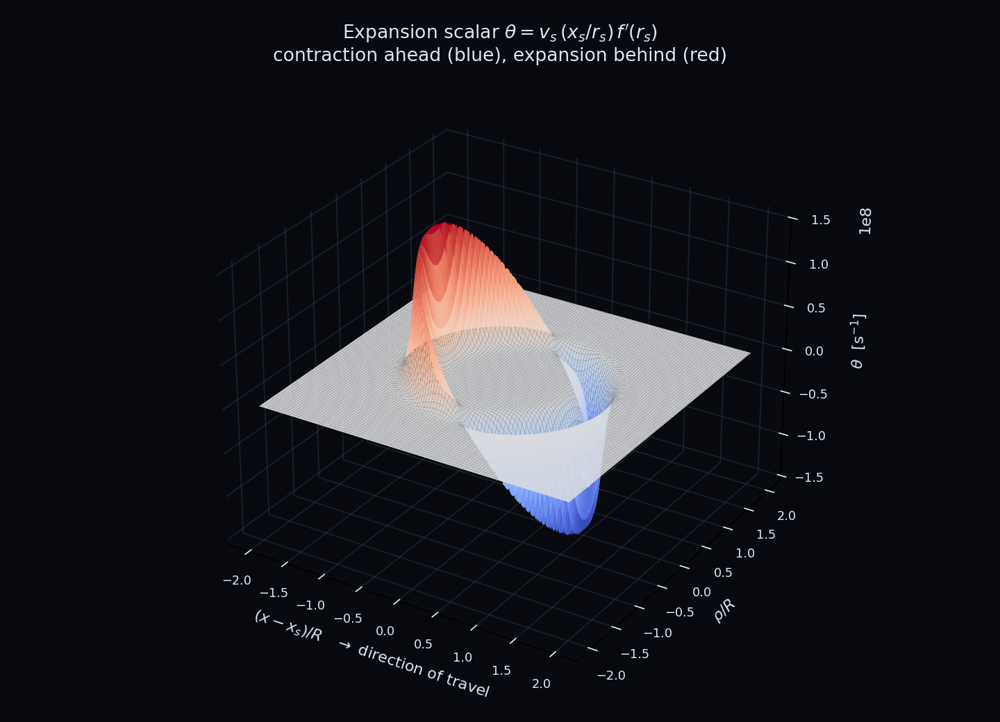
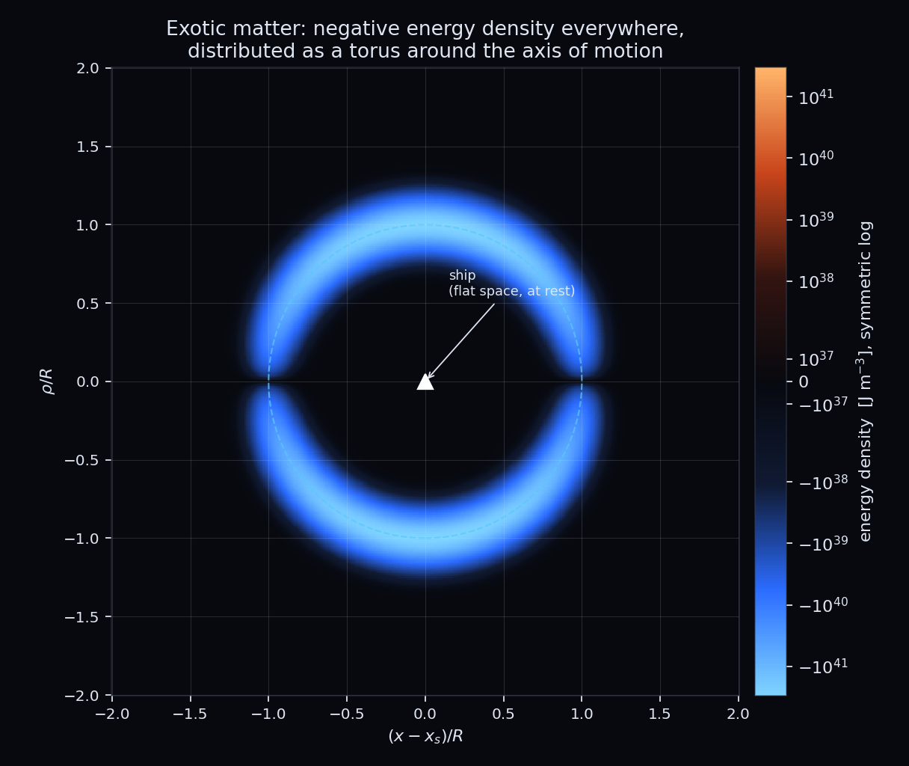
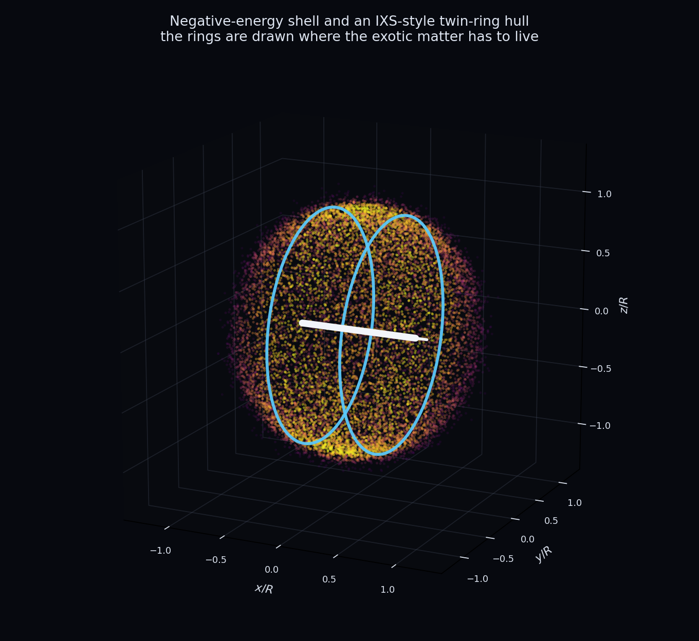

# Warp Drive

A numerical study of the **Alcubierre (1994) warp drive** metric — the geometry
behind every "IXS Enterprise"-style concept ship, with its two coaxial rings
wrapped around a central hull.

The metric, in ADM (3+1) form, is

$$ds^2 = -c^2 dt^2 + \left(dx - v_s f(r_s)\,dt\right)^2 + dy^2 + dz^2$$

with the bubble centred on $x_s(t)$, $v_s = dx_s/dt$, and
$r_s = \sqrt{(x - x_s)^2 + y^2 + z^2}$. The shape function $f$ goes from 1
inside the bubble to 0 outside:

$$f(r_s) = \frac{\tanh\left(\sigma(r_s + R)\right) - \tanh\left(\sigma(r_s - R)\right)}{2\tanh(\sigma R)}$$

Both regions are **exactly flat**. All the curvature lives in a wall of
thickness $\sim 1/\sigma$ at $r_s = R$. The ship never moves through space: it
sits at rest in a flat patch while the wall contracts space ahead of it and
expands it behind. Special relativity is never violated, because $v_s$ is a
*coordinate* velocity, not a local one.



## Install

```bash
git clone https://github.com/LoreMonti/Warp_Drive.git
cd Warp_Drive
pip install -e ".[dev]"
```

Runtime dependencies are `numpy` and `matplotlib` only; `pytest` is needed just
for the test suite.

## Usage

```bash
python scripts/run_alcubierre.py
python scripts/run_alcubierre.py --speed 2 --radius 50 --sigma 0.5
python scripts/run_alcubierre.py --no-animation
```

The script writes four figures, one animation and a mission report to
`output/`, which is not tracked. As a library:

```python
from warpdrive import AlcubierreMetric, profile_mission, format_profile
from warpdrive.constants import C_LIGHT

metric = AlcubierreMetric(speed=10 * C_LIGHT, radius=100.0, sigma=0.1)
print(format_profile(profile_mission(metric)))
```

## Layout

```
Warp_Drive/
├── README.md
├── ROADMAP.md
├── LICENSE
├── pyproject.toml
├── src/warpdrive/
│   ├── constants.py           # physical constants and unit conversions
│   ├── shapes.py              # radial profiles f(r), B(r) and derivatives
│   ├── integrators.py         # RK4 vectorised over an ensemble
│   ├── tracers.py             # Eulerian congruence dragged by the bubble
│   ├── diagnostics.py         # travel times, energy budget, horizon
│   ├── symbolic.py            # Einstein tensor via sympy        [roadmap 1]
│   ├── geodesics.py           # null-geodesic ray tracing        [roadmap 3]
│   ├── metrics/
│   │   ├── base.py            # WarpMetric: the 3+1 interface
│   │   ├── alcubierre.py      # the 1994 metric
│   │   └── broeck.py          # two-scale bubble                 [roadmap 2]
│   └── viz/
│       ├── style.py           # shared palette
│       ├── figures.py         # static figures
│       └── animation.py       # flyby animation
├── scripts/
│   └── run_alcubierre.py      # command line driver
├── tests/                     # pytest suite
└── docs/assets/               # images used by this README
```

Entries marked `[roadmap N]` are planned, not yet written; see
[ROADMAP.md](ROADMAP.md). Everything else is in place.

Every metric is written in the ADM form

$$ds^2 = -c^2 dt^2 + B(r_s)^2\left[\left(dx - \beta(r_s)\,dt\right)^2 + dy^2 + dz^2\right]$$

so a concrete spacetime is fixed by two radial profiles: the shift $\beta$,
which drags the coordinates, and the conformal factor $B$, which inflates
spatial volume. Alcubierre has $B = 1$ and $\beta = v_s f(r_s)$; Van Den Broeck
keeps that shift and adds a non-trivial $B$. Everything that can be derived
from the interface — proper time, the total energy budget, the horizon — lives
in `WarpMetric` and is written once, so the figures and the driver never need
to know which metric they were handed.

## Tests

```bash
pytest
```

Errors in general relativity rarely crash: a wrong sign or a missing factor of
$c$ produces plausible numbers. The suite pins the invariants that would catch
that — $f(0) = 1$, $d\tau/dt = 1$ at any $v_s$, $\varepsilon \leq 0$
everywhere, $\varepsilon = 0$ on the axis, $\theta$ antisymmetric under
$x \to -x$, superluminal motion in the *exterior* rejected as spacelike,
$E \propto v_s^2 R^2 \sigma$, and the horizon solver agreeing with the analytic
condition $f = 1 - c/v_s$. The closed-form energy budget is also checked
against the generic quadrature in the base class, which is the test that keeps
the interface honest when a second metric is added.

## What the code computes

**Expansion scalar** — negative ahead of the ship (space contracting) and
positive behind it (space expanding), reproducing the surface from the original
paper:

$$\theta = v_s \frac{x_s}{r_s} \frac{df}{dr_s}$$



**Energy density** seen by Eulerian observers, with $\rho^2 = y^2 + z^2$:

$$\varepsilon = -\frac{c^4}{8\pi G}\frac{v_s^2}{c^2}\frac{\rho^2}{4 r_s^2}\left(\frac{df}{dr_s}\right)^2$$

It is **negative everywhere it is non-zero** — the drive violates the weak
energy condition — and its distribution is a **torus** around the axis of
motion. That torus is the physical reason concept ships are drawn with rings:
the rings mark where the exotic matter has to be held.




**Energy budget** — the angular integral is analytic,
$\int (\rho^2/r^2)\,d\Omega = 8\pi/3$, which collapses the budget to a single
radial quadrature:

$$E = -\frac{c^2 v_s^2}{12 G}\int_0^\infty \left(\frac{df}{dr}\right)^2 r^2\,dr$$

**Causal structure** — for $v_s > c$ a photon emitted forward along the axis
obeys $\dot{x}_s = c - v_s\left[1 - f\right]$, which vanishes where
$f = 1 - c/v_s$. A horizon forms inside the bubble wall: the crew cannot signal
the front of their own bubble, so it cannot be steered, slowed, or switched off
from the inside.

**Proper time** — evaluated from the line element rather than assumed. On the
ship worldline $f = 1$ and $\dot{x} = v_s$, so $d\tau = dt$ exactly: no time
dilation at any $v_s$.

## Sample output

For $R = 100$ m, $1/\sigma = 10$ m, $v_s = 10c$:

```
Proxima Centauri, 4.2465 ly
  coordinate time  t   = 0.4246 yr
  crew proper time tau = 0.4246 yr        (dtau/dt = 1.000000)
  1g relativistic rocket, same trip: tau = 3.54 yr, t = 5.87 yr

  exotic energy    E   = -3.37e+47 J
  mass equivalent  M   = -3.75e+30 kg  =  -1.89 solar masses
  future horizon at 89.0 m ahead of the ship
```

Scaling of the required exotic mass, in solar masses:

| $v_s/c$ | $R = 10$ m | $R = 100$ m | $R = 1000$ m |
| ---: | ---: | ---: | ---: |
| 0.5 | $-9.7 \times 10^{-5}$ | $-4.7 \times 10^{-3}$ | $-4.7 \times 10^{-1}$ |
| 1 | $-3.9 \times 10^{-4}$ | $-1.9 \times 10^{-2}$ | $-1.9 \times 10^{0}$ |
| 2 | $-1.6 \times 10^{-3}$ | $-7.6 \times 10^{-2}$ | $-7.5 \times 10^{0}$ |
| 10 | $-3.9 \times 10^{-2}$ | $-1.9 \times 10^{0}$ | $-1.9 \times 10^{2}$ |
| 100 | $-3.9 \times 10^{0}$ | $-1.9 \times 10^{2}$ | $-1.9 \times 10^{4}$ |

$E \propto v_s^2 R^2 \sigma$. Alcubierre's own thin-wall estimate gave a
*negative* mass larger than the whole visible universe; the numbers above are
milder only because the wall here is 10 m thick rather than sub-nuclear.

## The honest part

The simulation is an exact solution of Einstein's equations — but that is a
weaker statement than it sounds. General relativity lets you write down *any*
metric and then read off, from
$G_{\mu\nu} = \frac{8\pi G}{c^4} T_{\mu\nu}$, the stress-energy needed to hold
it up. Alcubierre ran the equations backwards: he chose the geometry he wanted
and computed the matter it demands. The matter it demands does not exist.

Known obstructions, in rough order of severity:

1. **Exotic matter.** The required $T_{\mu\nu}$ violates the weak, null, and
   dominant energy conditions. Casimir-type effects give tiny, static,
   laboratory-scale negative energy densities — nothing remotely like a
   macroscopic shell.
2. **Quantum inequalities.** Pfenning & Ford (1997) showed the wall must be
   thinner than $\sim 10^2$ Planck lengths, which drives the energy requirement
   back up to absurd values (the mission report prints the wall thickness in
   Planck lengths so you can see how far off it is).
3. **The horizon.** Computed above: the bubble cannot be controlled from
   within, so it must be laid down in advance along the entire route — which
   requires something already at the destination.
4. **Causality.** Two superluminal bubbles on different trajectories can be
   combined into a closed timelike curve.
5. **Semiclassical instability.** The wall behaves like a horizon and radiates;
   Finazzi, Liberati & Barceló (2009) found the interior temperature diverges,
   destabilising the bubble.
6. **The bulldozer problem.** The animation shows it directly: particles near
   the axis are captured, since $f = 1$ forces them to $\dot{x} = v_s$. The
   bubble sweeps up interstellar matter and releases it, extremely blueshifted,
   at the destination (McMonigal, Lewis & O'Byrne 2012).

Modern work moves toward *subluminal* solitons with positive energy —
Bobrick & Martire (2021), Lentz (2021), Fell & Heisenberg (2021),
Schuster et al. (2023) — which are physically far more respectable but no
longer faster than light.

## Roadmap

A symbolic derivation of the stress-energy tensor, Van Den Broeck's two-scale
bubble and null-geodesic ray tracing are next, in that order; the plan and its
status live in **[ROADMAP.md](ROADMAP.md)**.

## References

- M. Alcubierre, *The warp drive: hyper-fast travel within general relativity*,
  Class. Quantum Grav. **11**, L73 (1994)
- M. J. Pfenning & L. H. Ford, Class. Quantum Grav. **14**, 1743 (1997)
- C. Van Den Broeck, Class. Quantum Grav. **16**, 3973 (1999)
- S. Finazzi, S. Liberati & C. Barceló, Phys. Rev. D **79**, 124017 (2009)
- B. McMonigal, G. F. Lewis & P. O'Byrne, Phys. Rev. D **85**, 064024 (2012)
- A. Bobrick & G. Martire, Class. Quantum Grav. **38**, 105009 (2021)
