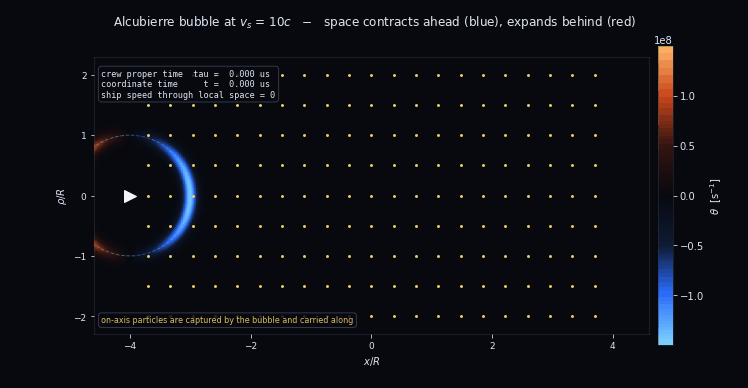
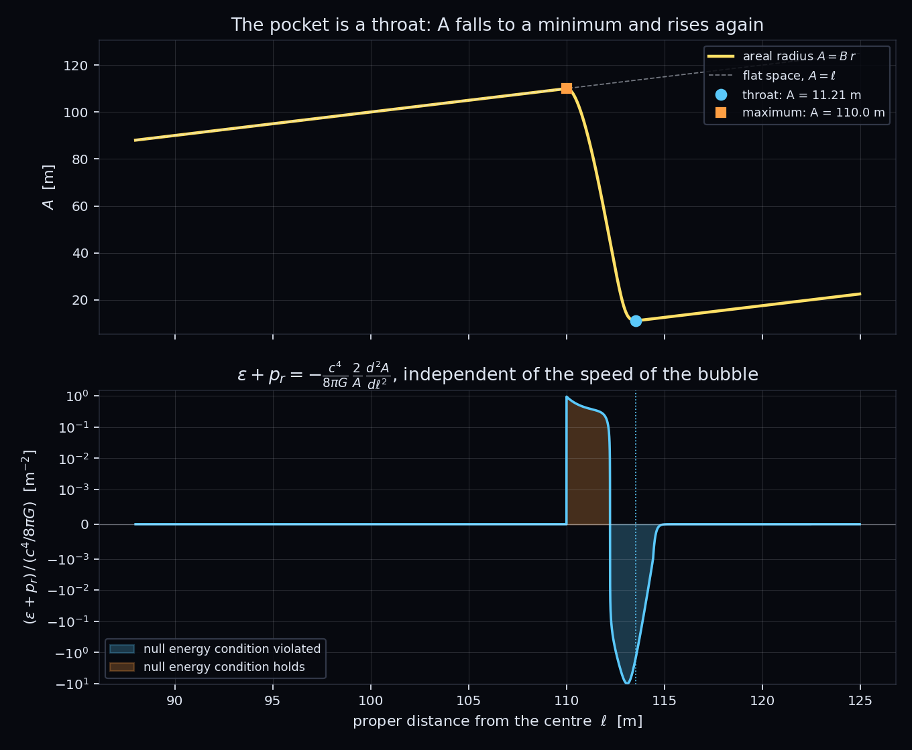
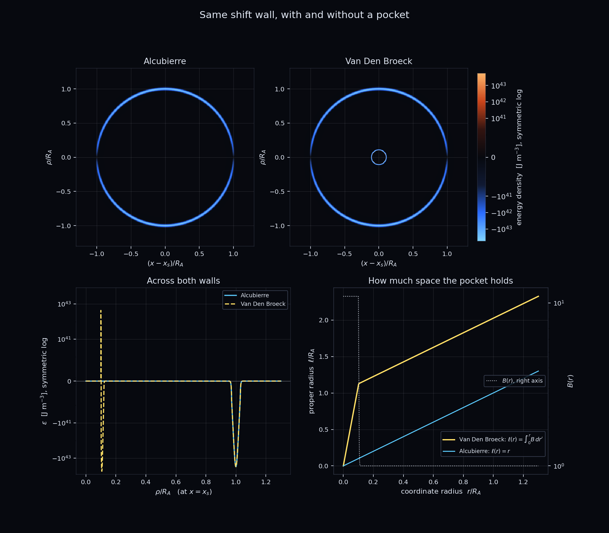
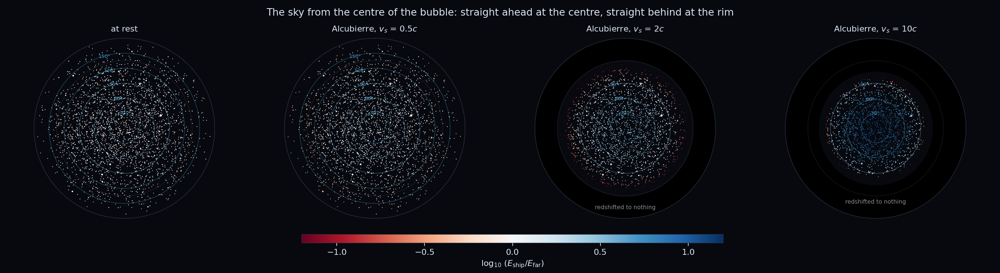
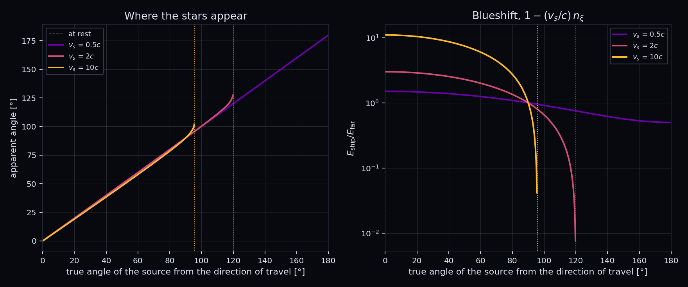
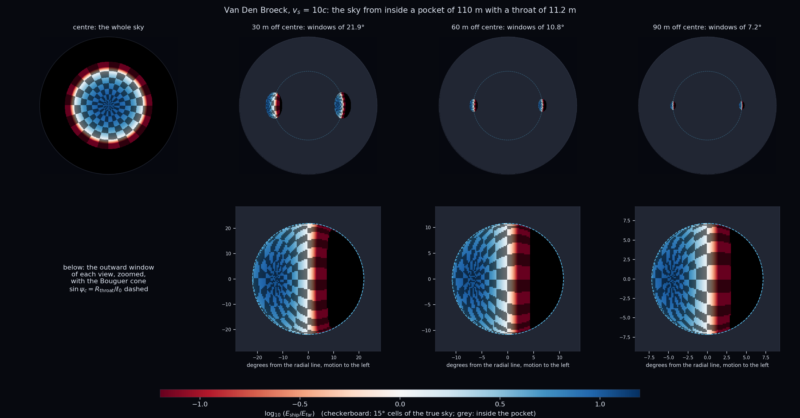

# Warp Drive

A numerical study of the **Alcubierre (1994) warp drive** metric — the geometry
behind every "IXS Enterprise"-style concept ship, with its two coaxial rings
wrapped around a central hull.

The metric, in ADM (3+1) form, is

```math
ds^2 = -c^2 dt^2 + \left(dx - v_s f(r_s)\,dt\right)^2 + dy^2 + dz^2
```

with the bubble centred on $x_s(t)$, $v_s = dx_s/dt$, and
$r_s = \sqrt{(x - x_s)^2 + y^2 + z^2}$. The shape function $f$ goes from 1
inside the bubble to 0 outside:

```math
f(r_s) = \frac{\tanh\left(\sigma(r_s + R)\right) - \tanh\left(\sigma(r_s - R)\right)}{2\tanh(\sigma R)}
```

Both regions are **exactly flat**. All the curvature lives in a wall of
thickness $\sim 1/\sigma$ at $r_s = R$. The ship never moves through space: it
sits at rest in a flat patch while the wall contracts space ahead of it and
expands it behind. Special relativity is never violated, because $v_s$ is a
*coordinate* velocity, not a local one.



## Install

```bash
git clone https://github.com/LoreMonti/Warp_Drive.git
cd Warp_Drive
python3 -m venv .venv && source .venv/bin/activate
pip install -e ".[dev]"
```

That one install command reads `pyproject.toml` and pulls in everything the
package needs: `numpy`, `matplotlib` and `sympy`, plus `pytest` from the `dev`
extra. Nothing at runtime imports sympy — it carries the derivation the rest of
the package is checked against, so it is a hard dependency rather than an
optional extra. Python 3.10 or newer; the results below were produced with
Python 3.10, numpy 2.2.6, matplotlib 3.10.9 and sympy 1.14.0.

## Usage

Three drivers reproduce the studies in this README. Each builds its bubbles,
writes its figures and prints a report, needs no arguments for the default run,
and lists its options with `--help`.

| script | what it does |
| --- | --- |
| `run_alcubierre.py` | the 1994 bubble: shape function, expansion scalar, exotic-matter shell, flyby animation and mission profile |
| `run_broeck.py` | the two-scale bubble: the same figures, the comparison with Alcubierre, the neck scan and the configuration of the 1999 paper |
| `run_sky.py` | null rays from the centre: the sky the crew sees at several speeds |
| `make_readme_images.py` | rebuilds the images shown in this README |

```bash
python scripts/run_sky.py
```

Figures go to `images/local/`, reports to `reports/`; neither is tracked, and
both are rebuilt by rerunning a script. The only tracked images are the ones in
this README, in `images/readme/`, with their parameters fixed in code.

As a library:

```python
from warpdrive import AlcubierreMetric, profile_mission, format_profile
from warpdrive.constants import C_LIGHT

metric = AlcubierreMetric(speed=10 * C_LIGHT, radius=100.0, sigma=0.1)
print(format_profile(profile_mission(metric)))
```

Van Den Broeck's bubble takes the same calls; `BroeckMetric.from_paper()` builds
the configuration of the 1999 paper:

```python
from warpdrive import BroeckMetric

paper = BroeckMetric.from_paper()
budget = paper.energy_budget_analytic()
print(budget.negative_mass, budget.positive_mass, paper.pocket_proper_radius())
```

## Layout

```
Warp_Drive/
├── README.md
├── ROADMAP.md
├── LICENSE
├── pyproject.toml
├── src/warpdrive/
│   ├── constants.py           # physical constants and unit conversions
│   ├── shapes.py              # radial profiles f(r), B(r) and derivatives
│   ├── integrators.py         # RK4 and adaptive RK45 over an ensemble
│   ├── tracers.py             # Eulerian congruence dragged by the bubble
│   ├── diagnostics.py         # travel times, energy budget, neck scan
│   ├── symbolic.py            # Einstein tensor: source of truth
│   ├── geodesics.py           # null rays: the sky from the bubble
│   ├── metrics/
│   │   ├── base.py            # WarpMetric: the 3+1 interface
│   │   ├── alcubierre.py      # the 1994 metric
│   │   └── broeck.py          # Van Den Broeck's two-scale bubble
│   └── viz/
│       ├── style.py           # shared palette
│       ├── figures.py         # static figures
│       ├── comparison.py      # Alcubierre against Van Den Broeck
│       ├── sky.py             # the view from the bridge
│       └── animation.py       # flyby animation
├── scripts/
│   ├── run_alcubierre.py      # command line driver
│   ├── run_broeck.py          # Van Den Broeck study
│   ├── run_sky.py             # null rays and the sky
│   └── make_readme_images.py  # rebuilds images/readme
├── tests/                     # pytest suite
├── images/
│   ├── readme/                # images used by this README, tracked
│   └── local/                 # figures written by the drivers, ignored
└── reports/                   # text reports written by the drivers, ignored
```

Everything listed is in place; open work is tracked in
[ROADMAP.md](ROADMAP.md).

Every metric is written in the ADM form

```math
ds^2 = -c^2 dt^2 + B(r_s)^2\left[\left(dx - \beta(r_s)\,dt\right)^2 + dy^2 + dz^2\right]
```

so a concrete spacetime is fixed by two radial profiles: the shift $\beta$,
which drags the coordinates, and the conformal factor $B$, which inflates
spatial volume. Alcubierre has $B = 1$ and $\beta = v_s f(r_s)$; Van Den Broeck
keeps that shift and adds a non-trivial $B$. Everything that can be derived
from the interface — proper time, the total energy budget, the horizon — lives
in `WarpMetric` and is written once, so the figures and the driver never need
to know which metric they were handed.

## Tests

```bash
pytest
```

Errors in general relativity rarely crash: a wrong sign or a missing factor of
$c$ produces plausible numbers. The suite pins the invariants that would catch
that — $f(0) = 1$, $d\tau/dt = 1$ at any $v_s$, $\varepsilon \leq 0$ everywhere,
$\varepsilon = 0$ on the axis, $\theta$ antisymmetric under $x \to -x$,
superluminal motion in the *exterior* rejected as spacelike,
$E \propto v_s^2 R^2 \sigma$, and the horizon solver agreeing with the analytic
condition $f = 1 - c/v_s$. The closed-form energy budget is also checked against
the generic quadrature in the base class, which is the test that keeps the
interface honest now that a second metric exists: for Van Den Broeck the two
agree on both signs of the budget.

### Where the physics comes from

None of those invariants constrain an overall constant. A density off by a
factor of two would keep every sign, every symmetry and every scaling law, and
the suite would stay green.

So the physics is not transcribed from papers. `symbolic.py` builds the
curvature of the ansatz from scratch with sympy — Christoffel symbols, Ricci
tensor, curvature scalar, Einstein tensor — keeping the full dependence on $w$,
and contracts it on the Eulerian normal $n^\mu = (1, b, 0, 0)$. That derivation
is the source of truth; the expressions in `metrics/` are the fast numpy path,
written by reading it.

Holding the two together:

| check | result |
| --- | --- |
| derived $\varepsilon$ vs the published Alcubierre density | difference exactly `0` |
| derived $\theta$ vs the published expansion | difference exactly `0` |
| derived vs `AlcubierreMetric.energy_density`, on a 400x400 grid | agreement to `5e-16` |
| cost of one derivation | 1.3 s ($B = 1$), 8.8 s (general $B$) |
| cost of evaluating the grid | 3.3 ms derived, 4.2 ms hand-written |

The numerical bridge feeds the package's own numpy shape functions into the
symbolically derived structure, so a mismatch can only come from the algebra of
one side or the other. It is the only test that pins the $c^4/8\pi G$ prefactor.

Both implementations are kept deliberately. The derivation is not the truth
either — it is a second program, with its own possible mistakes in the ansatz,
the analytic inverse or the contraction conventions. What counts as evidence is
that two independent routes agree, and deleting one would delete the evidence
rather than strengthen it.

## What the code computes

**Expansion scalar** — negative ahead of the ship (space contracting) and
positive behind it (space expanding), reproducing the surface from the original
paper:

```math
\theta = v_s \frac{x_s}{r_s} \frac{df}{dr_s}
```


**Energy density** seen by Eulerian observers, with $\rho^2 = y^2 + z^2$:

```math
\varepsilon = -\frac{c^4}{8\pi G}\frac{v_s^2}{c^2}\frac{\rho^2}{4 r_s^2}\left(\frac{df}{dr_s}\right)^2
```

It is **negative everywhere it is non-zero** — the drive violates the weak
energy condition — and its distribution is a **torus** around the axis of
motion. That torus is the physical reason concept ships are drawn with rings:
the rings mark where the exotic matter has to be held.


**Energy budget** — the angular integral is analytic,
$`\int (\rho^2/r^2)\,d\Omega = 8\pi/3`$, which collapses the budget to a single
radial quadrature:

```math
E = -\frac{c^2 v_s^2}{12 G}\int_0^\infty \left(\frac{df}{dr}\right)^2 r^2\,dr
```

The integral is taken over the distance from the wall, $s = r - R$, rather
than over $r$. A wall of $10^2$ Planck lengths around a femtometre bubble has
$R\sigma \sim 10^{18}$, beyond the range of double precision: every $r$ across
it rounds to the same number, while $s$ stays representable. The budget is
always reported as a negative and a positive part, $E_-$ and $E_+$, never as a
single net number; for Alcubierre $E_+ = 0$, but for a metric with a conformal
factor the two have different physical meaning and summing them would hide the
exotic matter.

**Causal structure** — for $v_s > c$ a photon emitted forward along the axis
obeys $\dot{x}_s = c - v_s\left[1 - f\right]$, which vanishes where
$f = 1 - c/v_s$. A horizon forms inside the bubble wall: the crew cannot signal
the front of their own bubble, so it cannot be steered, slowed, or switched off
from the inside.

**Proper time** — evaluated from the line element rather than assumed. On the
ship worldline $f = 1$ and $\dot{x} = v_s$, so $d\tau = dt$ exactly: no time
dilation at any $v_s$.

## Van Den Broeck's two-scale bubble

`BroeckMetric` keeps Alcubierre's shift and adds a conformal factor $B(r_s)$
equal to $1 + \alpha$ inside a pocket of radius $\tilde R$ and to $1$ outside a
transition region of thickness $\tilde\Delta$. A coordinate radius $\tilde R$
then encloses a proper radius $(1 + \alpha)\tilde R$: with $\alpha = 10^{17}$ and
$\tilde R = 10^{-15}$ m, a 200 m pocket sits behind a shift wall of radius
$3 \times 10^{-15}$ m. Only the separated configuration is implemented, with the
transition inside the flat interior of $f$.

Running the derivation with $B$ abstract gives, in that configuration,

```math
\varepsilon = \frac{c^4}{8\pi G}\left[\frac{B'^2}{B^4} - \frac{2B''}{B^3} - \frac{4B'}{r_s B^3}\right] - \frac{c^2 v_s^2}{32\pi G}\,\frac{\rho^2}{r_s^2}\,f'^2
```

and the expansion is Alcubierre's. The first term does not depend on $v_s$:
inflating volume costs energy even at rest. It changes sign inside the
transition region, but with $\psi = \sqrt{B}$ an integration by parts shows
its total is strictly positive,

```math
E_B = \frac{c^4}{2G}\int_0^\infty \frac{B'^2}{B}\,r^2\,dr > 0
```

so the budget is reported as a negative and a positive part. For the paper's
configuration ($n = 80$, $v_s = c$, a shift wall of $10^2$ Planck lengths):

| part | computed | published |
| --- | --- | --- |
| transition region, $E_-$ | $-1.38 \times 10^{30} \~ \text{kg}$ | $-1.4 \times 10^{30} \~ \text{kg}$ |
| transition region, $E_+$ | $+4.87 \times 10^{30} \~ \text{kg}$ | $+4.9 \times 10^{30} \~ \text{kg}$ |
| shift wall, $E_-$ | $-2.08 \times 10^{29} \~ \text{kg}$ | $-6.3 \times 10^{29} \~ \text{kg}$ |
| total | $-0.80 \~ M_\odot$ and $+2.45 \~ M_\odot$ | |

The shift wall does not match because the paper uses a different profile $f$;
only its order of magnitude is comparable. For scale: an Alcubierre bubble of
100 m radius with the same Planck-thin wall needs about $-6 \times 10^{62}$ kg
(Pfenning & Ford), ten orders of magnitude above the mass of the visible
universe. The two-scale bubble brings that below a solar mass of negative
energy, but more than twice as much positive energy comes with it, and every
obstruction listed below still applies.

Two numbers from the paper are *not* reproduced: the peak density of eq. (14)
and the curvature radius of eq. (20), placed at $w = 0.349$ where the printed
profile has $B - 1 \sim 10^{-18}$. The computation finds both near
$w \approx 0.575$; they are not used as checks.

**The pocket is a throat.** Inside the shift wall, in the frame of the bubble,
$f = 1$ and the metric is ultrastatic,

```math
ds^2 = -c^2 dt^2 + B(r)^2\left(dr^2 + r^2 d\Omega^2\right)
```

so its stress-energy depends on the geometry of space alone, not on $v_s$.
With the proper radial distance $`d\ell = B\,dr`$ and the areal radius
$`A = B\,r`$, the circumference of a sphere over $2\pi$, the null energy along
radial light rays is

```math
\varepsilon + p_r = -\frac{c^4}{8\pi G}\,\frac{2}{A}\,\frac{d^2 A}{d\ell^2}
```

the relation of a Morris–Thorne wormhole throat. In the flat pocket and outside
the transition $dA/d\ell = 1$; a pocket larger inside than outside,
$(1 + \alpha)\tilde R > \tilde R + \tilde\Delta$, forces $A$ to fall to a
minimum and rise again. That minimal sphere flares out, so by Hochberg and
Visser's theorem, whose definition of a throat is geometric and covers trivial
topology, the null energy condition fails there: **for any profile of $B$, at
any speed, for every observer**. The pocket needs exotic matter even at rest,
for a reason that does not depend on how the energy of a warp bubble is
defined. For the default pocket the throat has an areal radius of 11.2 m and
$`\varepsilon + p_r = -1.35\,c^4/8\pi G`$ per square metre there; for the 1999
configuration the throat is $1.46 \times 10^{-15}$ m across. Since
$dA/d\ell$ is 1 on both sides, $`\int (\varepsilon + p_r)\,A\,d\ell = 0`$: the
violation is balanced exactly by the region round the maximum of $A$, where the
condition holds. The derivation is done twice, in the moving Cartesian chart of
`symbolic.derive` and in the static spherical chart of `symbolic.derive_pocket`,
and the two agree to $10^{-9}$.



With the same shift wall, the pocket adds a thin shell carrying both signs of
energy and holds more space than its coordinate size: at the default parameters
10 m of coordinate radius hold 110 m of proper radius.



Where the thirty orders of magnitude come from, and where they stop: holding the
pocket at 100 m of proper radius and the wall at $10^2$ Planck lengths, and
keeping the paper's proportions $\tilde R = \tilde\Delta = R/3$, the shift wall
costs $\propto R^2$ while the transition region depends only on
$(1 + \alpha)\tilde R$ and stays at $-0.69$ and $`+2.45\,M_\odot`$ for any neck
much smaller than the pocket. Shrinking the neck pays off until the wall drops
below the transition region, near the paper's $R = 3 \times 10^{-15}$ m; below
that the budget has a floor.


## The view from the bridge

For constant $v_s$ the metric is static in the rest frame of the bubble,
$\xi = x - v_s t$:

```math
ds^2 = -c^2 dt^2 + B^2\left[\left(d\xi - \tilde\beta\,dt\right)^2 + dy^2 + dz^2\right], \qquad \tilde\beta = -v_s\,(1 - f)
```

so a photon has a conserved Hamiltonian, and `geodesics.py` integrates
Hamilton's equations backwards from the ship:

```math
H = \frac{c}{B}\,|p| + \tilde\beta\,p_\xi, \qquad \dot x^i = \frac{\partial H}{\partial p_i}, \qquad \dot p_i = -\frac{\partial H}{\partial x^i}
```

An Eulerian observer measures a photon energy proportional to $|p|/B$. At the
ship $\tilde\beta = 0$, far away $B = 1$ and $\tilde\beta = -v_s$, so the
conservation of $H$ fixes the blueshift of every source without integrating
anything:

```math
\frac{E_\mathrm{ship}}{E_\mathrm{far}} = 1 - \frac{v_s}{c}\,n_\xi
```

with $n$ the direction in which the light travels far from the bubble. Three
consequences, each checked against the ray integrator:

- a star straight ahead appears $1 + v_s/c$ times bluer, eleven times at $10c$;
- no light with $n_\xi > c/v_s$ reaches the ship. Behind a superluminal bubble
  the sky is **dark**, because the bubble outruns the light chasing it: only
  sources within $\arccos(-c/v_s)$ of the direction of travel can be seen, and
  the hidden fraction of the sky is $(1 - c/v_s)/2$, 45 % at $10c$;
- a ray traced towards the rear stalls at the horizon, exactly where
  `horizon_offset` puts it, and its momentum grows as $e^{\kappa c t}$ with
  $`\kappa = (v_s/c)\,|f'(h)|`$, the analogue of a surface gravity.

From the centre the sky is symmetric about the direction of travel, so a fan of
rays in one plane describes all of it. The views below are fisheye images of a
procedural star field: straight ahead at the centre of each disc, straight
behind at the rim, stars coloured by $E_\mathrm{ship}/E_\mathrm{far}$ and
sized by the flux they deliver.



Apart from the visible limit, the stars barely move: the apparent angle stays
close to the true one until the last few degrees, where the sky is stretched
over the rest of the view and redshifted to nothing.

**Brightness.** $I_\nu/\nu^3$ is conserved along a ray, so the surface
brightness of the sky scales as the fourth power of the frequency ratio
$R = E_\mathrm{ship}/E_\mathrm{far}$. A star is a point, so its flux also
carries the magnification $\mu$, the ratio of the solid angles it covers with
and without the bubble:

```math
\frac{F_\mathrm{ship}}{F_\mathrm{far}} = R^4\,\mu, \qquad \mu = \frac{\sin\theta_\mathrm{look}}{\sin\theta_\mathrm{source}}\,\frac{d\theta_\mathrm{look}}{d\theta_\mathrm{source}}
```

A star straight ahead arrives $`(1 + v_s/c)^4\,\mu`$ times brighter:
$1.34 \times 10^4$ times at $10c$, where $11^4 = 14641$ is reduced by
$\mu = 0.91$. Integrated over the view, an isotropic background of starlight
reaches the crew

```math
\frac{1}{4\pi}\int R^4\,d\Omega_\mathrm{look} = \frac{1}{4\pi}\int R^4\,\mu\,d\Omega_\mathrm{source}
```

times brighter than at rest: 1.51 at $0.5c$, 12.1 at $2c$ and **1507 at
$10c$**, most of it shifted into the ultraviolet. If the bubble shifted
frequencies but left the stars in place ($\mu = 1$) the integral would have the
closed form $[(1 + u)^5 - \max(0, 1 - u)^5]/(10u)$, with $u = v_s/c$; the
distortion of the sky takes 6 % off it at $10c$. Both integrals are computed
from the traced rays and agree to $10^{-6}$.



For a ship at the centre, Van Den Broeck's pocket changes nothing: $B$ is
spherically symmetric, so rays leaving the centre cross it radially and only
slow down, and the blueshift above does not contain $B$. With the same shift
wall the two skies agree to $10^{-12}$ rad.

**Away from the centre** the pocket takes over. Inside the shift wall the
spatial metric is $B^2\delta_{ij}$, so for light $B$ acts as a spherically
symmetric refractive index, and Bouguer's invariant holds along every ray:

```math
B(r)\,r\,\sin\psi = L
```

with $\psi$ the angle to the radial direction. $`B\,r`$ is the areal radius, the
circumference of a sphere over $2\pi$, and its minimum outside the pocket is a
**throat**: a ray leaves the pocket only if $L$ is below the throat radius.
From a proper distance $\ell_0$ from the centre the outside is therefore seen
only through two windows about the radial line, one outwards and one through
the centre, of half-angle

```math
\sin\psi_c = \frac{R_\mathrm{throat}}{\ell_0}
```

and every other line of sight stays inside the pocket. For the default pocket,
110 m across with an 11.2 m throat, the windows are 21.9° at 30 m from the
centre and 7.2° at 90 m, and the whole sky is squeezed into them.
`trace_rays_3d` traces the rays in three dimensions from any point inside the
bubble; the edge of each window falls on the closed-form cone.



For the configuration of the 1999 paper the throat is $1.46 \times 10^{-15}$ m.
One metre from the centre of the 100 m pocket, the crew would see the entire
universe through a window of $10^{-15}$ rad, and the inside of the pocket in
every other direction.

## Sample output

For $R = 100$ m, $1/\sigma = 10$ m, $v_s = 10c$:

```
Proxima Centauri, 4.2465 ly
  coordinate time  t   = 0.4246 yr
  crew proper time tau = 0.4246 yr        (dtau/dt = 1.000000)
  1g relativistic rocket, same trip: tau = 3.54 yr, t = 5.87 yr

  negative energy  E-  = -3.37e+47 J       (positive part E+ = 0)
  exotic mass      M-  = -3.75e+30 kg  =  -1.89 solar masses
  future horizon at 89.0 m ahead of the ship
```

Scaling of the required exotic mass, in solar masses:

| $v_s/c$ | $R = 10 \~ \text{m}$ | $R = 100 \~ \text{m}$ | $R = 1000 \~ \text{m}$ |
| --- | --- | --- | --- |
| $0.5$ | $-9.7 \times 10^{-5}$ | $-4.7 \times 10^{-3}$ | $-4.7 \times 10^{-1}$ |
| $1$ | $-3.9 \times 10^{-4}$ | $-1.9 \times 10^{-2}$ | $-1.9$ |
| $2$ | $-1.6 \times 10^{-3}$ | $-7.6 \times 10^{-2}$ | $-7.5$ |
| $10$ | $-3.9 \times 10^{-2}$ | $-1.9$ | $-1.9 \times 10^{2}$ |
| $100$ | $-3.9$ | $-1.9 \times 10^{2}$ | $-1.9 \times 10^{4}$ |

$E \propto v_s^2 R^2 \sigma$. Alcubierre's own thin-wall estimate gave a
*negative* mass larger than the whole visible universe; the numbers above are
milder only because the wall here is 10 m thick rather than sub-nuclear.

## The honest part

The simulation is an exact solution of Einstein's equations — but that is a
weaker statement than it sounds. General relativity lets you write down *any*
metric and then read off, from
$G_{\mu\nu} = \frac{8\pi G}{c^4} T_{\mu\nu}$, the stress-energy needed to hold
it up. Alcubierre ran the equations backwards: he chose the geometry he wanted
and computed the matter it demands. The matter it demands does not exist.

Known obstructions, in rough order of severity:

1. **Exotic matter.** The required $T_{\mu\nu}$ violates the weak, null, and
   dominant energy conditions. Casimir-type effects give tiny, static,
   laboratory-scale negative energy densities — nothing remotely like a
   macroscopic shell.
2. **Quantum inequalities.** Pfenning & Ford (1997) showed the wall must be
   thinner than $\sim 10^2$ Planck lengths, which drives the energy requirement
   back up to absurd values (the mission report prints the wall thickness in
   Planck lengths so you can see how far off it is).
3. **The horizon.** Computed above: the bubble cannot be controlled from
   within, so it must be laid down in advance along the entire route — which
   requires something already at the destination.
4. **Causality.** Two superluminal bubbles on different trajectories can be
   combined into a closed timelike curve.
5. **Semiclassical instability.** The wall behaves like a horizon and radiates;
   Finazzi, Liberati & Barceló (2009) found the interior temperature diverges,
   destabilising the bubble.
6. **The bulldozer problem.** The animation shows it directly: particles near
   the axis are captured, since $f = 1$ forces them to $\dot{x} = v_s$. The
   bubble sweeps up interstellar matter and releases it, extremely blueshifted,
   at the destination (McMonigal, Lewis & O'Byrne 2012). Light does the same
   to the crew: at $10c$ the ship receives about 1500 times the ambient
   starlight, blueshifted by up to a factor of 11.

Modern work moves toward *subluminal* solitons with positive energy —
Bobrick & Martire (2021), Lentz (2021), Fell & Heisenberg (2021),
Schuster et al. (2023) — which are physically far more respectable but no
longer faster than light.

## Roadmap

The next steps, an observer away from the centre of the pocket and the
overlapping Van Den Broeck configuration, live in
**[ROADMAP.md](ROADMAP.md)**.

## References

- M. Alcubierre, *The warp drive: hyper-fast travel within general relativity*,
  Class. Quantum Grav. **11**, L73 (1994)
- M. J. Pfenning & L. H. Ford, Class. Quantum Grav. **14**, 1743 (1997)
- C. Van Den Broeck, Class. Quantum Grav. **16**, 3973 (1999)
- S. Finazzi, S. Liberati & C. Barceló, Phys. Rev. D **79**, 124017 (2009)
- B. McMonigal, G. F. Lewis & P. O'Byrne, Phys. Rev. D **85**, 064024 (2012)
- A. Bobrick & G. Martire, Class. Quantum Grav. **38**, 105009 (2021)
